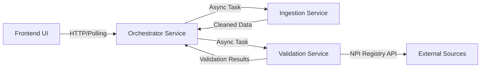

# Valid8 - AI-Powered Provider Credential Validaton Platform

## 1. Executive Summary
Valid8 is a microservices-based platform designed to automate the ingestion, cleaning, and validation of healthcare provider data. It leverages Large Language Models (LLMs) and external registries (NPI) to detect discrepancies, normalize messy datasets, and assign confidence scores to provider records.

Unlike traditional synchronous validation tools, Valid8 implements an **Asynchronous Job Orchestration** pattern, allowing for scalable processing of large datasets with real-time status feedback to the user interface.

## 2. System Architecture

The system follows a distributed microservices architecture:



### Core Components
1.  **Frontend (Next.js)**: A responsive React application that manages file uploads, initiates async jobs, polls for status updates, and visualizes validation results.
2.  **Orchestrator Service (FastAPI)**: The central control plane. It accepts file uploads, spawns background tasks, and manages the state of the processing pipeline (Ingestion → Validation).
3.  **Ingestion Service (FastAPI)**: Responsible for parsing raw CSVs, normalizing data formats, and using LLMs (Gemini) to clean unstructured text fields.
4.  **Validation Service (FastAPI)**: Performs authoritative checks against the CMS NPI Registry and uses LLMs to compare provided data vs. registry data, generating confidence scores and discrepancy reports.

## 3. Technology Stack

### Frontend
*   **Framework**: Next.js 14 (App Router)
*   **Styling**: Tailwind CSS, Shadcn UI
*   **State Management**: React Hooks (Polling architecture for async jobs)
*   **Visualization**: Lucide React Icons, Custom Progress Cards

### Backend
*   **Framework**: FastAPI (Python)
*   **Concurrency**: Python `asyncio`, BackgroundTasks
*   **AI/LLM**: Google Gemini 1.5 Flash (via `google.generativeai` SDK)
*   **Networking**: REST (Components communicate via HTTP)

## 4. Microservices Breakdown

### A. Orchestrator Service (`/backend/orchestrator`)
*   **Port**: `8000`
*   **Role**: API Gateway & Workflow Manager.
*   **Key Endpoints**:
    *   `POST /start-job`: Accepts a file, generates a `job_id`, and starts the async pipeline.
    *   `GET /status/{job_id}`: Returns real-time progress (0-100%), current stage (`ingestion`, `validation`), and logs.

### B. Ingestion Service (`/backend/ingestion`)
*   **Port**: `8001`
*   **Role**: Data Cleaning & Normalization.
*   **Process**:
    *   Accepts a raw CSV file.
    *   Uses LLM to correct spelling, formatting (Phone, Address), and normalize specialties.
    *   Returns a structured JSON of `cleaned_providers`.

### C. Validation Service (`/backend/validation`)
*   **Port**: `8002`
*   **Role**: Verification & Risk Analysis.
*   **Process**:
    *   Iterates through cleaned providers.
    *   Queries `https://npiregistry.cms.hhs.gov` for authoritative data.
    *   Uses LLM to compare Input vs. Registry data.
    *   **Logic**: Enforces strict rules (e.g., Missing NPI = 0% Confidence, Critical Risk).

## 5. Setup & Installation

### Prerequisites
*   Node.js v18+
*   Python 3.10+
*   Google Gemini API Key

### Environment Variables
Create `.env` files in respective backend folders:

**`backend/ingestion/.env` & `backend/validation/.env`**
```env
GEMINI_API_KEY=your_gemini_key_here
GEMINI_MODEL=gemini-1.5-flash
```

**`backend/orchestrator/.env`**
```env
INGESTION_URL=http://localhost:8001/ingest/csv
VALIDATION_URL=http://localhost:8002/validate
```

### Running the Services
You need 4 terminal instances to run the full stack:

**1. Orchestrator**
```bash
cd backend/orchestrator
python -m uvicorn main:app --reload --port 8000
```

**2. Ingestion Service**
```bash
cd backend/ingestion
python -m uvicorn main:app --reload --port 8001
```

**3. Validation Service**
```bash
cd backend/validation
python -m uvicorn main_v:app --reload --port 8002
```

**4. Frontend**
```bash
# Root directory
npm run dev
```

## 6. Directory Structure
```
valid8/
├── app/                  # Next.js App Router pages
├── components/           # React UI components
│   └── pages/            # Page-specific logic (Upload, Progress, Results)
├── backend/
│   ├── orchestrator/     # Orchestrator Service code
│   ├── ingestion/        # Ingestion Service code
│   └── validation/       # Validation Service code
├── public/               # Static assets
└── package.json          # Frontend dependencies
```

## 7. Operational Workflow
1.  **User uploads CSV** on the UI.
2.  **UI calls Orchestrator** (`/start-job`), receiving a Job ID.
3.  **UI polls Orchestrator** (`/status/{job_id}`) every 1s.
4.  **Orchestrator** sends file to **Ingestion Service**.
5.  **Ingestion** cleans data and returns it to Orchestrator.
6.  **Orchestrator** sends cleaned data to **Validation Service**.
7.  **Validation** verifies NPIs and returns scores.
8.  **UI detects completion** via polling and renders the Results Dashboard.
